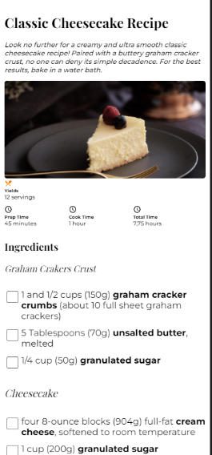
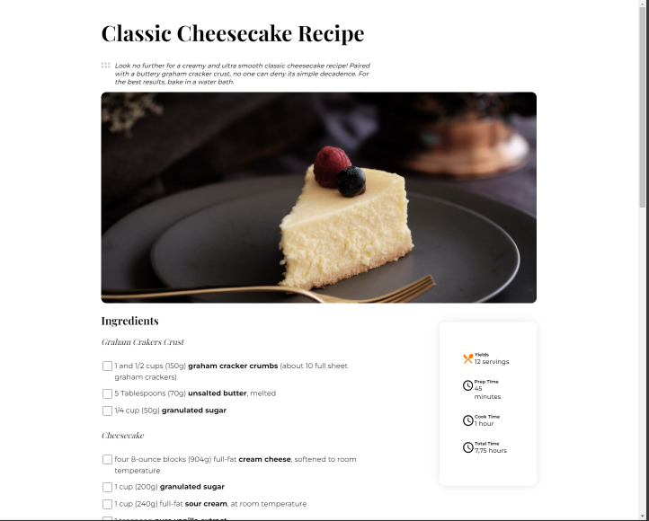

<h1 align="center">Recipe page master - devchallenges.io</h1>

<div align="center">
   Solution for a challenge from  <a href="http://devchallenges.io" target="_blank">Devchallenges.io</a>.
</div>

<div align="center">
  <h3>
    <a href="https://recipe-page-master-devchallenges.surge.sh/">
      Demo
    </a>
    <span> | </span>
    <a href="https://github.com/JimAxl1/Recipe-page-devchallenges.io">
      Solution
    </a>
    <span> | </span>
    <a href="https://devchallenges.io/challenges/OEKdUZ6xs0h99C38XVht">
      Challenge
    </a>
  </h3>
</div>

<!-- TABLE OF CONTENTS -->

## Table of Contents

- [Overview](#overview)
- [Features](#features)
- [How to use](#how-to-use)
- [Contact](#contact)

<!-- OVERVIEW -->

## Overview





- This is a responsive page using html and css

## Features

<!-- List the features of your application or follow the template. Don't share the figma file here :) -->

This application/site was created as a submission to a [DevChallenges](https://devchallenges.io/challenges) challenge. The [challenge](https://devchallenges.io/challenges/TtUjDt19eIHxNQ4n5jps) was to build an application to complete the following user stories:

- [x] User story: This is a completed user stories
- [ ] User story: This is a incompleted user stories
- [ ] User story: This is a incompleted 2nd user stories

## How To Use

To clone and run this application, you'll need [Git](https://git-scm.com) and [Node.js](https://nodejs.org/en/download/) (which comes with [npm](http://npmjs.com)) installed on your computer. From your command line:

```bash
# Clone this repository
$ git clone https://github.com/JimAxl1/Recipe-page-devchallenges.io

# Install dependencies
$ npm install

# Run the app
$ npm start
```

## Contact

- GitHub [@JimAxl1](https://github.com/JimAxl1)